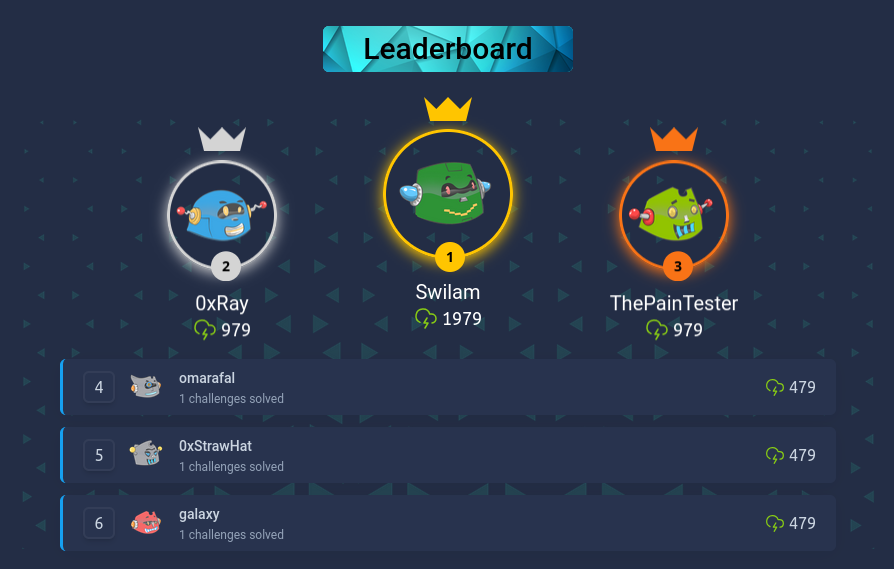

# 🚩 FahemSec Pwn CTF Writeups

> A collection of writeups for the **FahemSec Pwn CTF**, documenting my journey of learning Binary Exploitation from scratch through AI-assisted research, reverse engineering, and hands-on practice.

<p align="center">


</p>

---

# 🏆 Competition Result

<p align="center">
  
</p>

<p align="center">
🥇 <strong>Rank #1</strong><br>
🎯 <strong>Score: 1979</strong>
</p>

---

# 📖 About

This repository contains my writeups for the **FahemSec Pwn CTF**.

Before participating in this competition:

* I had **no practical experience** in Binary Exploitation (Pwn).
* I had **never solved a Binary Exploitation CTF** before.
* I had **never read a Pwn writeup** before.
* My background was primarily in **Web Security**, **Bug Bounty**, and **Penetration Testing**.

This repository documents my journey from complete beginner to solving every challenge in the competition.

The goal is not only to publish solutions, but to explain the reasoning behind each exploit and document what I learned throughout the process.

---

# 🤖 AI Transparency

This repository represents a **100% AI-assisted learning journey**.

AI was extensively used throughout the competition as a learning partner to:

* Reverse engineer binaries
* Understand assembly instructions
* Learn Linux internals
* Understand exploitation primitives
* Analyze vulnerabilities
* Develop exploit strategies
* Debug exploit scripts
* Explain low-level concepts
* Verify my understanding

Every writeup was rewritten after understanding the challenge and reviewing the exploitation process.

The purpose of this repository is **education and documentation**, not to claim previous expertise in Binary Exploitation.

---

# 📚 Topics Covered

These writeups include concepts such as:

* ELF Internals
* Linux Memory Layout
* Linux System Calls
* Pwntools
* GDB / GEF
* Ghidra
* Stack Buffer Overflow
* Function Pointer Hijacking
* Information Leaks
* Shellcode
* Return-Oriented Programming (ROP)
* Jump-Oriented Programming (JOP)
* Linux IPC
* UNIX Domain Sockets
* NX
* PIE
* RELRO
* ASLR
* Stack Fundamentals

---

# 📂 Writeups

| Challenge          | Main Technique                          | Difficulty | Status |                     Writeup                     |
| ------------------ | --------------------------------------- | :--------: | :----: | :---------------------------------------------: |
| Signal Relay       | Jump-Oriented Programming (JOP)         |   Medium   |    ✅   |      [Writeup](./Signal%20Relay/README.md)      |
| Talk to the Daemon | Linux IPC / Binary Exploitation         |   Medium   |    ✅   | [Writeup](./Talk%20to%20the%20Daemon/README.md) |
| The Scanner        | Binary Exploitation                     |   Medium   |    ✅   |       [Writeup](./The%20Scanner/README.md)      |
| Overflow the IPC   | Stack Buffer Overflow + Shellcode + IPC |   Medium   |    ✅   |   [Writeup](./Overflow%20the%20IPC/README.md)   |

---

# 📁 Repository Structure

```text
FahemSec-PWN-CTF
│
├── README.md
│
├── Signal Relay
│   └── README.md
│
├── Talk to the Daemon
│   └── README.md
│
├── The Scanner
│   └── README.md
│
├── Overflow the IPC
│   └── README.md
│
└── assets
    └── leaderboard.png
```

---

# 🎯 Repository Goals

This repository was created to:

* Document my Binary Exploitation learning journey.
* Build a public knowledge base.
* Explain exploitation techniques in a beginner-friendly way.
* Practice reverse engineering and exploit development.
* Track my progress in low-level security research.

Rather than simply publishing exploit scripts, each writeup aims to explain:

* How the vulnerability was discovered.
* Why the vulnerability exists.
* Why the exploit works.
* What happens inside memory and CPU registers.
* How the challenge could be solved from scratch.

---

# 🚀 What's Next?

This repository is only the beginning.

My next learning targets include:

* pwn.college
* Hack The Box
* picoCTF
* CSAW CTF
* BlueHens CTF
* ImaginaryCTF
* Other Binary Exploitation challenges

I plan to keep documenting everything I learn as I continue improving my Binary Exploitation skills.

---

# ⚠️ Disclaimer

These writeups are intended for **educational purposes only**.

All challenge rights belong to **FahemSec** and their respective authors.

---

# ❤️ Acknowledgments

Huge thanks to the **FahemSec** team for creating an excellent beginner-friendly Pwn CTF that introduced me to Binary Exploitation in such an enjoyable way.

---

# ⭐ Support

If you found these writeups useful, consider giving this repository a ⭐.

Feedback, corrections, and suggestions are always welcome through Issues or Pull Requests.
